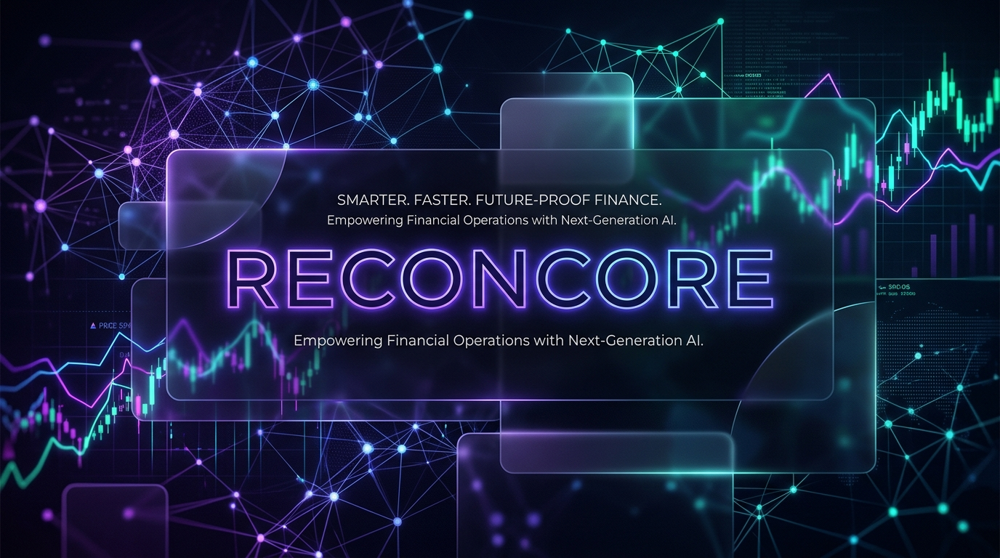
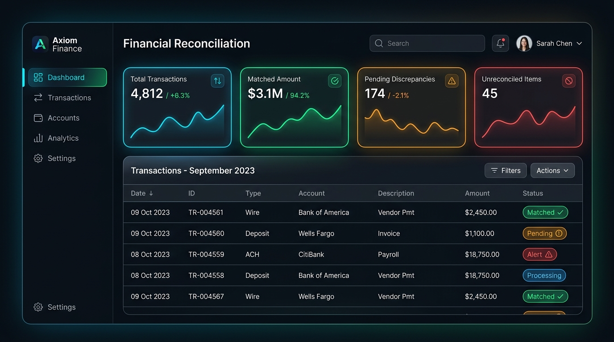

<div align="center">
  
  <br/><br/>
  
  <h1>Reconcore: The AI Finance Controller</h1>
  <p><strong>Autonomous Financial Operations. Real-time Cash Position. Zero Spreadsheets.</strong></p>

  <a href="#overview">Overview</a> •
  <a href="#key-features">Key Features</a> •
  <a href="#how-it-works">How It Works</a> •
  <a href="#tech-stack">Tech Stack</a> •
  <a href="#getting-started">Getting Started</a>
</div>

<br/>

## 🌟 Overview

Financial reconciliation is traditionally a slow, error-prone, and soul-crushing process. Processor exports, bank statements, and internal ledgers all speak different dialects. 

**Reconcore** changes that. Built as an autonomous AI Finance Controller, it automatically ingests financial data, normalizes schemas, and uses a multi-tier matching engine to close the loop instantly. It clears up to 90% of transactions automatically and surfaces genuinely ambiguous cases in a human-in-the-loop Exception Queue.

<div align="center">
  
</div>

---

## ⚡ Key Features

* 🤖 **AI-Driven Reconciliation:** Multi-tier matching (Exact, UTR, and Split-Sum) clears transactions 17x faster than manual review.
* 🛡️ **Exception Inspector:** Rejects "hallucinations". The AI flags any discrepancies below 100% confidence, providing its reasoning and candidate bank lines for human approval.
* 📈 **Live Cash Position:** Because transactions are cleared instantly, your cash visibility is real-time, not a week old.
* 🧩 **Universal Normalization:** Seamlessly translates disparate financial dialects (e.g., Razorpay exports vs. HDFC bank statements) into a unified audit trail.

---

## ⚙️ How It Works

1. **Ingestion & Normalization:** The system ingests raw CSVs, API responses, or ledger files and normalizes them into standard `ReconciliationRecord` objects.
2. **The Rule Stack:**
   - *Rule 01:* Exact amount + UTR Match (High Confidence)
   - *Rule 02:* Partial Reference + Date Window
   - *Rule 03:* Constrained Split Sum (resolving batched or split settlements)
3. **The Queue:** Matches are cleared automatically. Exceptions drop into the dashboard queue for a 1-click human resolution.

---

## 🛠️ Tech Stack

**Frontend**
* Next.js (App Router)
* React & TypeScript
* Tailwind CSS (Custom Dark Mode / Glassmorphism)
* Lucide Icons

**Backend**
* Python 3.11
* FastAPI (High-performance API)
* SQLAlchemy (Async Database Operations)
* SQLite (Persistent Storage)

---

## 🚀 Getting Started

### Prerequisites
Make sure you have [Docker](https://www.docker.com/) and Docker Compose installed.

### Run Locally

1. **Clone the repository:**
   ```bash
   git clone https://github.com/Surajpilla/AI-finance-controller.git
   cd AI-finance-controller
   ```

2. **Start the stack:**
   ```bash
   docker-compose up --build
   ```

3. **Access the application:**
   - Frontend Dashboard: `http://localhost:3000`
   - Backend API Docs: `http://localhost:8000/docs`

4. **Generate Synthetic Data:**
   To test the AI controller, you can populate the database with synthetic matching data.
   ```bash
   # Run from the backend directory
   cd backend
   python scripts/generate_data.py
   ```

---
<div align="center">
  <i>Smarter. Faster. Future-Proof Finance.</i>
</div>
